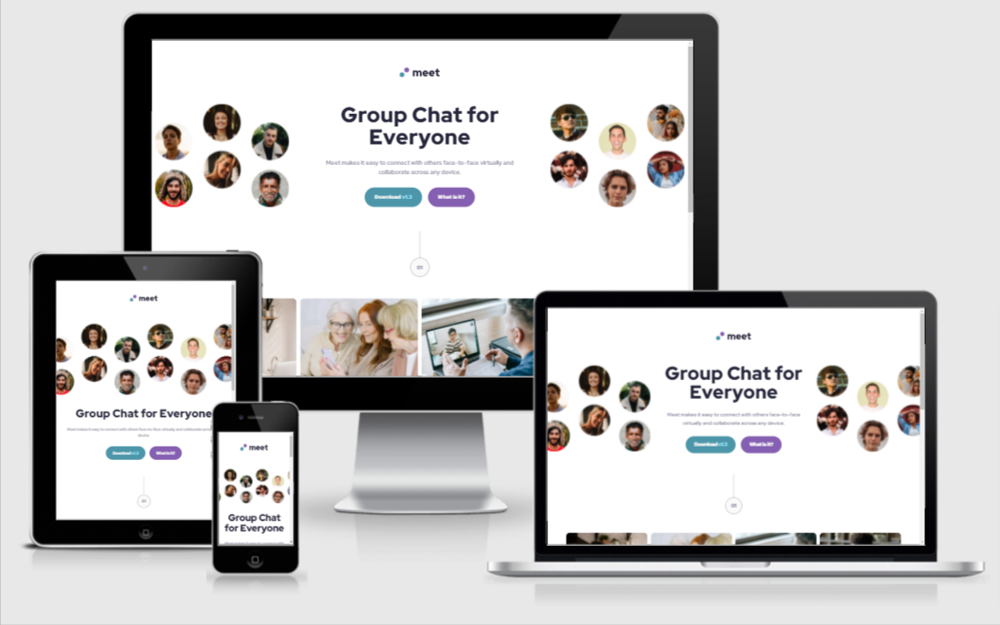
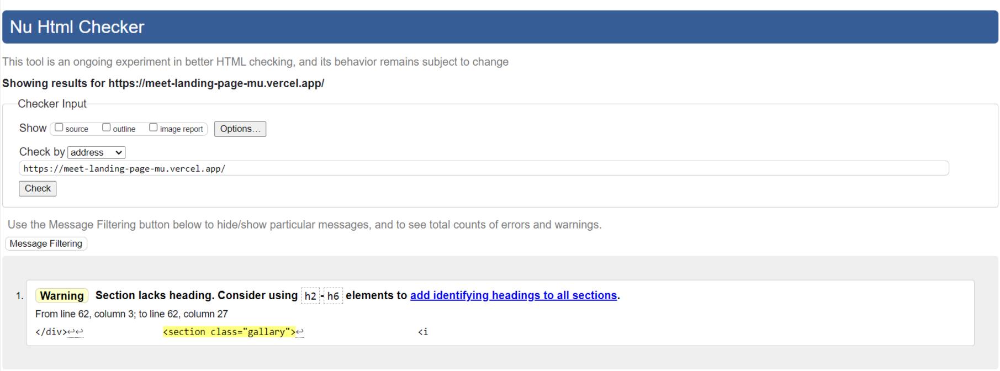
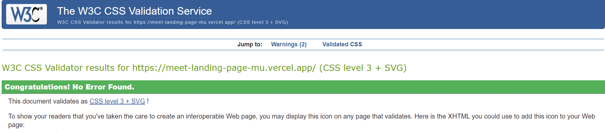
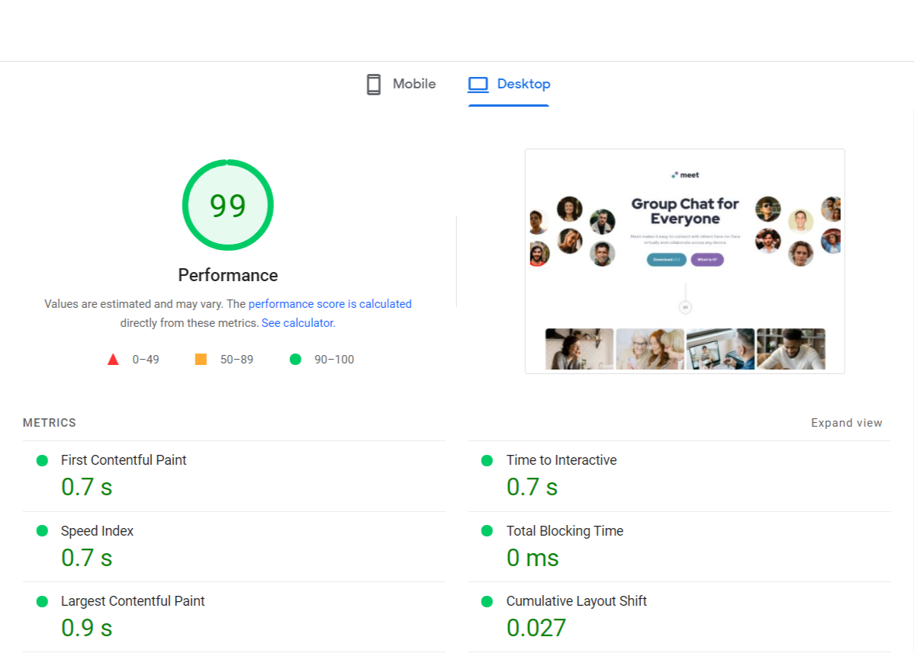
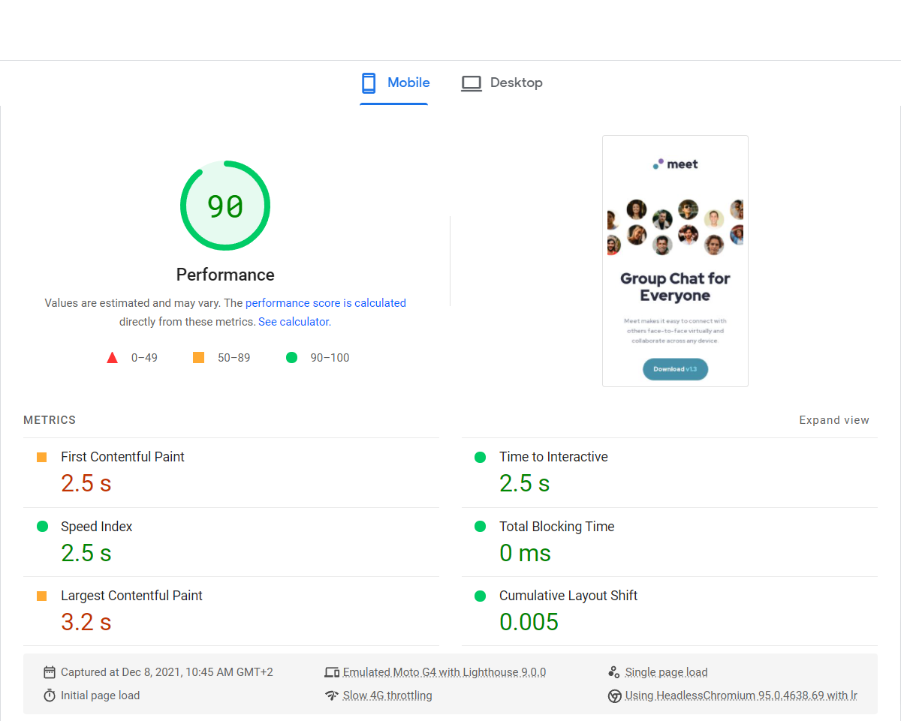

# Frontend Mentor - Meet landing page solution

This is a solution to the [Meet landing page challenge on Frontend Mentor](https://www.frontendmentor.io/challenges/meet-landing-page-rbTDS6OUR). Frontend Mentor challenges help you improve your coding skills by building realistic projects.

## Table of contents

- [Overview](#overview)
  - [The challenge](#the-challenge)
  - [Screenshot](#screenshot)
  - [Links](#links)
- [My process](#my-process)
  - [Built with](#built-with)
  - [Testing](#testing)
- [Author](#author)

## Overview

### The challenge

Users should be able to:

- View the optimal layout depending on their device's screen size
- See hover states for interactive elements

### Screenshot

### Links

- Solution URL: [https://www.frontendmentor.io/solutions/meet-landing-page-solution-rOaWMXnhx](https://www.frontendmentor.io/solutions/meet-landing-page-solution-rOaWMXnhx)
- Live Site URL: [https://meet-landing-page-mu.vercel.app/](https://meet-landing-page-mu.vercel.app/)

## My process

### Built with

- Semantic HTML5 markup
- Sass
- Flexbox
- CSS grid
- Media queries

### Testing

- HTML
  No errors were returned when passing through the official W3C validator HTML Validation just one warning related to not using headings inside a section tag which is not necessary in the current case since there is no headings to be displayed over the gallary section.
  
- CSS
  No errors were found when passing through the official (Jigsaw) validator CSS Validation
  
- Page speed
  The webpage achieved a score of 99 for desktop and 90 for mobile
  
  
- Website accessablity
  The webpage has a high accessabliity score of 94
  

### Deployment

The site was deployed to Vercel. The steps to deploy are as follows:

- Create a new GitHub repository with a project name of "RPSLS-Game".
- Push your project to the GitHub repository.
- Open the Vercel website and login (Signup if you don't have an account)
- Create a new project and import the Git repository.
- The live link can be found here - https://equalizer-landing-page-ten.vercel.app/

## Author

- Frontend Mentor - [@zDevtutor](https://www.frontendmentor.io/profile/zDevtutor)
